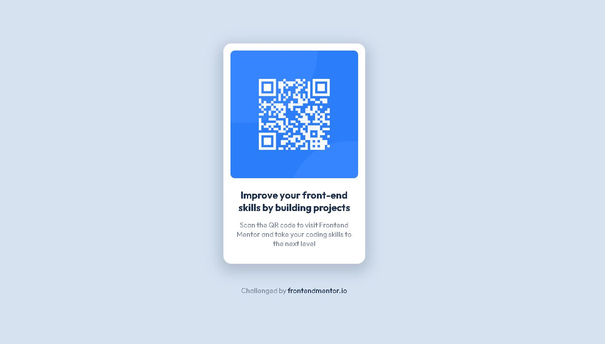

### About The Project
Hello everyone!
This is my first challenge from frontendmentor.io. The main challenge is to build out this QR code component and get it looking as close to the design as possible. the challenge is perfect for an absolute beginner just like me. It only requires some basic knowledge of HTML and CSS, and also a little bit understanding of design principle would be so helpful.

I do not have access to the Figma sketch so i created one before jumping into code editor to get some detail understanding of its layout.

### Links

- Solution URL: [Add solution URL here](https://your-solution-url.com)
- Live Site URL: [Add live site URL here](https://your-live-site-url.com)

## My process

### Built with

- Semantic HTML5 markup
- CSS custom properties
- Desktop-first workflow
